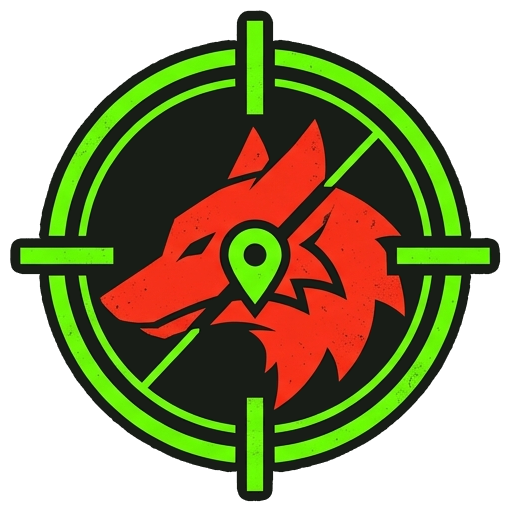
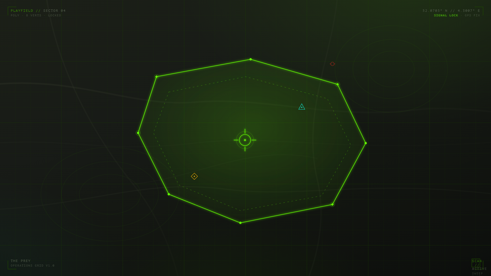
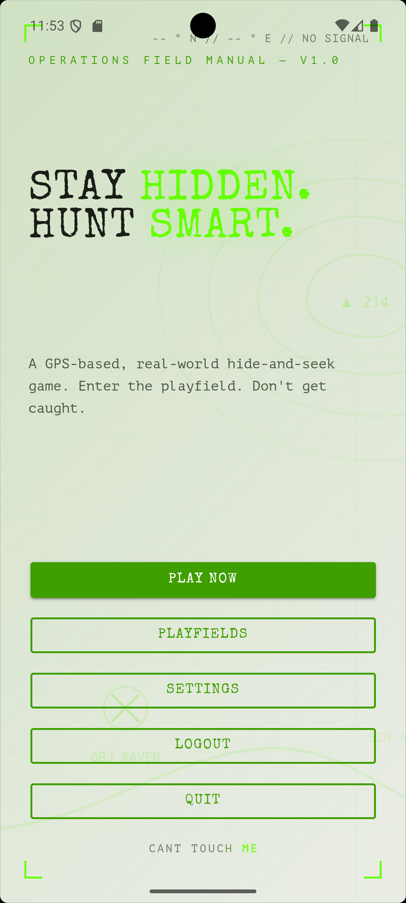
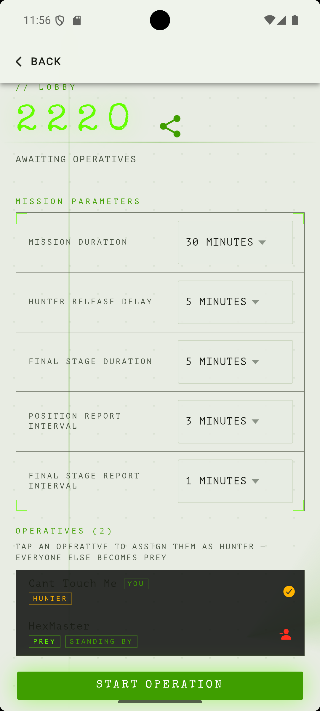
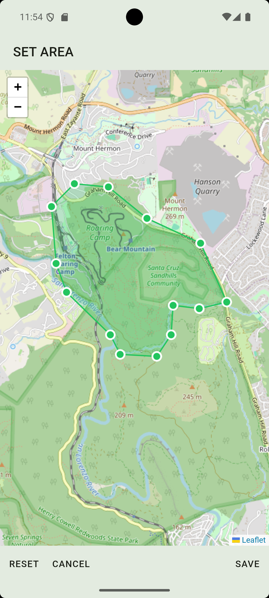
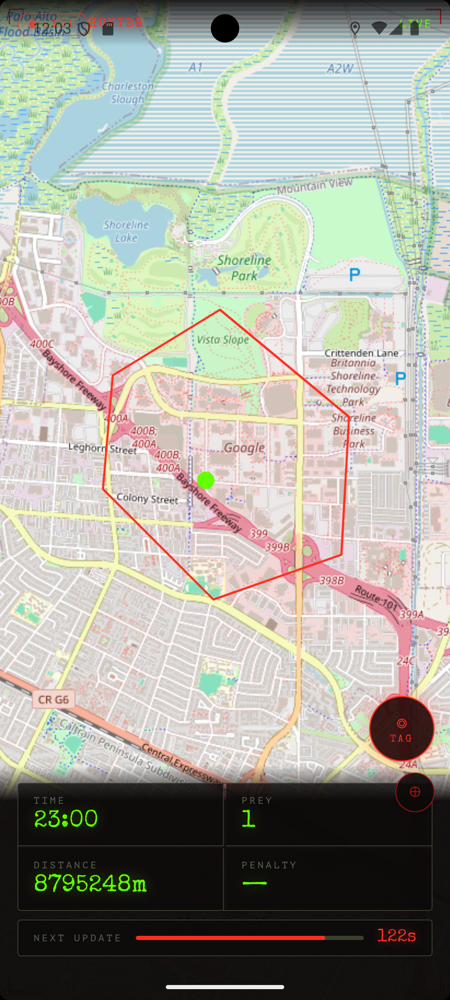
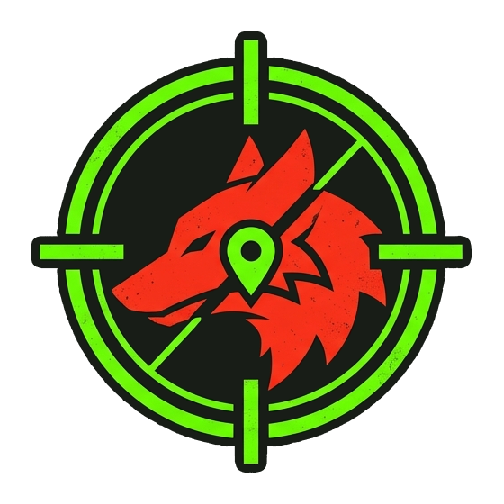

  

<h1 align="center">THE PREY</h1>

  <strong>Real-world hide-and-seek, powered by GPS.</strong> 
  Scatter into the city. Stay off the radar. Survive the hunt.

  
  &nbsp;
  

  

---

## 🎯 The hunt is real

The clock starts. You melt into alleys, parks and side streets while the **Hunter** counts down. Then the chase goes live — and every minute your phone betrays your position with a fresh GPS ping on the Hunter's map.

Run too far? **Out of bounds.** Get cornered? **Tagged.** Outlast the timer? **You win.**

It's tag for grown-ups, played across an entire neighbourhood, refereed by satellites.

> 📍 **One Hunter. Many Prey. One map. No hiding forever.**

---

## ⚡ How it works

| | |
|---|---|
| 🗺️ **1. Draw the arena** | Pin a polygon on the map — a park, a campus, your whole town. That's the playfield. Save it and reuse it. |
| 👥 **2. Gather your pack** | Create a game, share the code, watch friends drop into the lobby. Pick who plays the Hunter. |
| 🏃 **3. Scatter** | The game starts and the Prey get a head start to vanish. The Hunter is held back… for now. |
| 📡 **4. Stay off the radar** | Your location is broadcast to the Hunter on a timer. Keep moving, use cover, don't get boxed in. |
| 🤝 **5. The tag** | The Hunter has to physically reach you to take you out. Survive to the final whistle and the Prey win. |

---

## 📱 See it in action

  
  
  
  

<em>Tactical HUD, live map, real-time tracking — built for the chase.</em>

---

## 🐺 Why you'll love it

- **🌍 The world is the board.** No console, no arena — just your city and your legs.
- **⏱️ Heart-pounding real time.** Live location, countdowns, proximity warnings and that nerve-shredding "next ping" bar.
- **🎮 Easy to start, hard to master.** Learn it in one round; argue about strategy for weeks.
- **👨‍👩‍👧‍👦 Built for groups.** Birthdays, team outings, student nights, family weekends — 2 players or a whole crowd.
- **🔁 Infinitely replayable.** New playfield, new pack, new chase. Reuse the spots that work; discover public ones nearby.
- **🆓 Grab it and go.** Download, sign in, play.

---

## 🚀 Get in the game

  

1. **Install** from Google Play.
2. **Sign in** — takes seconds.
3. **Create a game**, share the code, and round up your friends.
4. **Step outside.** The hunt is waiting.

> 🍏 *iOS is on the way.* Want to be first in line? Keep an eye on [theprey.nl](https://theprey.nl).

---

## 🦺 Play smart, play safe

The Prey is an **outdoor, real-world** game. Half the fun is moving fast — so look up from the screen:

- Watch for **traffic** and obey the rules of the road.
- Stay on **public, accessible** ground — no trespassing, no climbing where you shouldn't.
- Agree the **boundary and ground rules** with your group before you start.
- Mind the **weather, the dark, and each other.** Bring water; bring sense.

Have a blast — and come home in one piece.

---

## 🛠️ For developers

The Prey is a .NET 10 modular-monolith backend (Azure, Aspire, Dapr, Web PubSub) with an Ionic / Angular mobile client. If you're here for the code rather than the chase:

- 📚 **[Documentation](docs/README.md)** — architecture, API, game design, deployment
- 🧭 **[Architecture overview](docs/architecture/overview.md)** · **[Client](docs/architecture/client.md)** · **[REST API](docs/api/endpoints.md)** · **[Real-time](docs/api/realtime.md)**
- 💡 **[Improvement proposals](docs/improvements/README.md)** · 🔐 **[Security assessment](docs/security/README.md)**
- 👷 **[Contributor guide (CLAUDE.md)](CLAUDE.md)** — standards, build & test commands

---

   
  <strong>The Prey</strong> — you can run, but your GPS can't hide. 
  <a href="https://play.google.com/store/apps/details?id=nl.hexmaster.theprey">Download now</a> · <a href="https://theprey.nl">theprey.nl</a>

